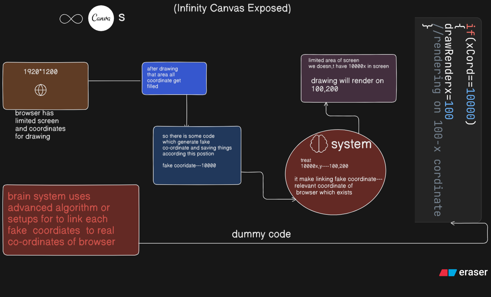

# InfinityCanvasLogicExposed

I am trying to know this from various time 
I literally used ai stackoverflow other things not too much with focus but
i am unable to understadn how they done this,

i just understand that i might need to move context some how,
after doign lots of ai,and seeing their localstorage of excalidraw,tldraw,
i found they used some different coordinate to draw each drawing and literally might get hit aroudn 52000x i unable to understand how it happening overall

so i left there.

today i just randomly withou mood i tell replit hey build infinity canvas for me literally he build for me but i can,t sees any codes,i asked him hey tell me how implement that without logic,no codes, just tell what thing i should used and the answer is same like two coordinate system browser and your world just these two line he says.

but here i doesn,t had any clue how might these things gone work.

so i think let,s try by doign some thing so first of all i opened up tldraw,excalidraw i added some stylign there to check hey whether the actual context is movign or not and i surprised it's not moving so this is not options.

so i am just setup basic code files and after i runnign random function stuff and thinking how and some way then i relised hey what if i use here 3000 but render at 1000 in browser. to confirm this i think might i am wrong, i think might they changed the browser default co-ordinate system  i google and i just followed the gemini response blindly , it says no you can not update accordint to it. it is read only propertly. so i think might  what i am think also using via some hard coded and advanced algorithms.
to just mimic things i know those gone work i just put an Xcordinate Named Variable i have put several value to it and i am just rendering things to available browser co-ordinates.

so i know that they don,t use condition for every x,y co-ordinates.
they have some smart advanced algorithm which creates these fake co-ordinates and links them to real browser co-ordinates with time.
so whenver they random somthign on x---20000 so due to some codes it goes 
and renders on somethign to browser co-ordinates like maybe 1000,2000 etc.

this repo just contains litte bit mimic code and this ideas discovered mistakely still it not complete.

if this information is wrong or the ideas is not correct so you can issue it might i will remove it or update it  to correct it.

here ai usage i think are 10% and other are 90% of me as i think ai gives me hints so that 10% but those are not at enough all for it.
